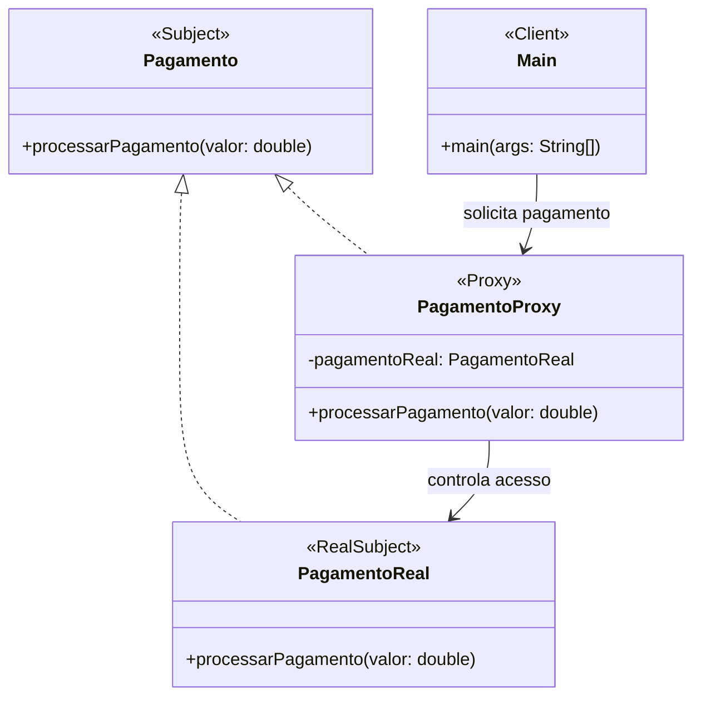

# Sistema de Pagamento - Padrão Proxy

## Descrição

Este projeto demonstra a implementação do padrão de projeto **Proxy** utilizando o contexto de um sistema de pagamentos.

O padrão Proxy fornece um objeto substituto que controla o acesso a outro objeto. Neste exemplo, o proxy realiza validações e verificações antes de permitir que um pagamento seja processado.

## Estrutura do Projeto

```text
src
├── main
│   └── java
│       └── br.com.pagamento.proxy
│           ├── Main.java
│           ├── Pagamento.java
│           ├── PagamentoReal.java
│           └── PagamentoProxy.java
│
└── test
    └── java
        └── br.com.pagamento.proxy
            └── PagamentoProxyTest.java
```

## Participantes do Padrão Proxy

| Classe         | Papel               |
| -------------- | ------------------- |
| Pagamento      | Subject (Interface) |
| PagamentoReal  | Real Subject        |
| PagamentoProxy | Proxy               |
| Main           | Cliente             |

## Funcionamento

1. O cliente solicita o processamento de um pagamento.
2. A solicitação é enviada para o `PagamentoProxy`.
3. O proxy verifica se o valor informado é válido.
4. Caso a validação seja aprovada, o proxy delega a operação para `PagamentoReal`.
5. O pagamento é processado.

## Diagrama de Classes (Mermaid)



## Casos de Teste

Os testes verificam:

* Processamento de pagamento com valor válido.
* Rejeição de pagamento com valor igual a zero.
* Rejeição de pagamento com valor negativo.

## Tecnologias Utilizadas

* Java
* JUnit 5
* Maven
* IntelliJ IDEA

## Exemplo de Execução

Entrada:

```text
500.00
```

Saída:

```text
Verificando autorização do pagamento...
Pagamento de R$ 500.0 processado com sucesso.
```
